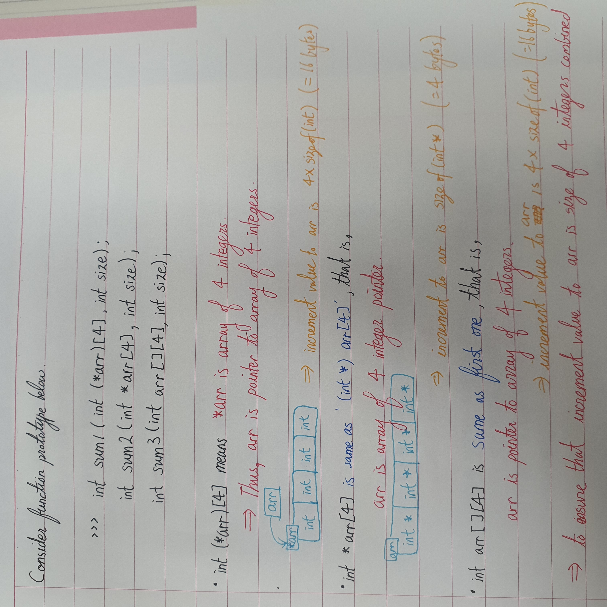

# **Function**
```cpp
int add(int, int);  // Function prototype.

// Function definition.
int add(int a, int b) {
    return a + b;
}
```
*add* is **<em>function name</em>**.  
*int* in front of function name is **<em>function return type</em>**.  
*int a, int b* is called **<em>parameter list</em>**.  
   
**Parameter** is variable defined in a function definition. It is also called as formal parameter.  
**Argument** is variable passed to a function in a function call. It is also called as actual argument.  
   
Function call. Called function. Calling function.

# **Preprocessor**
Things that start with *#* is preprocessor. They are also called **<em>directive</em>**.   
Below are examples.
```cpp
#include <iostream>
#define PI 3.141592
```

# **Name of header file**
| Types of header | Rule | Example | Desc. |
| :---: |  :---: | :---: | :---: |
|Old C| Ends in .h | math.h | Can be used in both C and C++. |
|Old C++| Ends in .h | iostream.h | Can be used in C++. |
|**New C++**| No extension | iostream | Can be used in C++ and uses *std * namespace. |
|**Derived from C**| Has prefix *c*. No extension. | cmath (derived from math.h) | Can be used in C++. |

# **Namespace**
It is similar to namespace in Python. (Perhaps it is exactly same.)
1. Uses prefix '**<em>[namespace]::</em>**' before classes, variables, and functions. (ex. std::cout & std::endl)  
(Similar to import statement in Python)
2. Can be skipped by using '**using namespace [namespace];**'.  
(Similar to import ~ as ~ in Python.)
3. Can use above statement selectively. (ex. '**using namespace std::cout;**' and '**using namespace std::endl;**')  
(Similar to from ~ import ~ in Python)  

When using 'using namespace ~' statement inside a function. It is only valid in that function.

# **Overloading**
**Operator overloading** makes operators have multiple meanings.  (Just like in Python.)  
**Method overloading** makes methods behave in multiple ways.  (Just like in Java.)  
**Function overloading** is same as method overloading except that it is overloading of functions.

# **Declaration, Definition, and Reference**
```cpp
// C++ program to show difference between
// definition and declaration of a 
// variable
#include <iostream>
using namespace std;
  
int main() {
    // this is declaration of variable a
    int a;  

    // this is initialization of a.
    // It is also called as assignment to variable a.
    a = 10;

    // definition = declaration + assignment.
    // Also called initialization of b.
    int b = 20;

    // declaration and definition
    // of variable 'a123'
    char a123 = 'a';

    // This is also both declaration and definition
    // as 'c' is allocated memory and
    // assigned some garbage value.
    float c;

    // Multiple declarations and definitions
    int _c, _d45, e;

    // Multiple assignments
    _c = _d45 = e = b;

    // Let us print a variable
    cout << a123 << endl;  // Message statement.

    // This is reference. It is similar to definition.
    // Now, ref is another name for a
    // and points to same memory address.
    int& ref = a;
    
    return 0;  // Return statement.
}
```

# **Class, Object, and Instance**
**Class** is user-defined data type.  
**Object** is declared class. It is *instance of class*.   
**Instance** is actualized object. When a values are assigned to object, it is called instance.  
To be honest, **Object** and **Instance** are basically the same thing.

```cpp
int x;
x = 10;
```

*int* is class.  
*x* in first line is object.  
*x* in second line has *assigned value* of 10 and *can be used in operations*, thus it is instance.  

# **Initialization**
```cpp
    int x = 5;      // Initialize x to 5.
    int x(5);       // Initialize x to 5.
    int x{ 5 };     // Initialize x to 5.
    int x = { 5 };  // Initialize x to 5.
    int x = { };    // Initialize x to 0.
    int x{ };       // Initialize x to 0.
```
# **Integer format**
```cpp
int decimal = 10;
int octal = 010; // 0 in front.
int hexa = 0x10; // 0x in front.
```

```cpp
std::cout << std::hex << 42 << endl;  // Print 42 in hex.
std::cout << std::oct << 42 << endl;  // Print 42 in octal.
std::cout << std::dec << 42 << endl;  // Print 42 in decimal.
```

For **long** type constants, you can use ***l*** or ***L*** suffix. (ex. 42L)  
For **unsigned int** type constants, you can use ***u*** or ***U*** suffix. (ex. 42U)  
For **unsigned long** type constants, you can use ***ul***, ***uL***, ***Ul***, or ***UL*** suffix. (ex. 42UL)  
For **long long** type constants, you can use ***ll*** or ***LL*** suffix. (ex. 42LL)  
For **unsigned long long** type constants, you can use ***ull***, ***uLL***, ***Ull***, or ***ULL*** suffix. (ex. 42ULL)  


# **Membership Operator**
**<em>[operator].[method_name](arguments)</em>** => **.** is called membership operator. (ex. cout.put('!'); )

# **wchar_t**
**w**ide **char**acter **t**ype  
This supports wide character sets. Same as integer.
Need to use ***wcin*** and ***wcout*** for wchar_t.  
Put L in front of the character or string. (ex. wchar_t bob = L'P'; )  

# **char16_t and char32_t**
***char16_t*** is 16 bit and uses prefix *u*. (ex. u'C' & u"be good")  
        (matches universal character name of form, \u00F6. )  
***char32_t*** is 32 bit and uses prefix *U*. (ex. U'R' & U"dirty rat")  
        (matches universal character name of form, \U0000222B. )  

# **Float**
1. 12.34, 0.00034
2. 3.45E-4, 7e4  (3.45E-4 = 3.45 * 10 ^ -4, where -4 is exponent and 3.45 is mantissa.)  
```cpp
// Do not use exponent output format. Prints to 6th decimal points.
cout.setf(ios_base::fixed, ios_base::floatfield);
```

Floating point numbers are usually stored as ***double***. (ex. 4.1, 4.1E4)  
When using **float**, use ***f*** or ***F*** suffix. (ex. 4.1f, 3e5F)  
When using **long double**, use ***l*** or ***L*** suffix. (ex. 4.1L, -3.1E-3L)  

# **Type-casting**
There is chance where data is lost.
## Implicit Type-Casting
1. If one of operand is *long double*, another operand is type-casted to *long double*.
2. If not 1 and one of operand is *double*, another operand is type-casted to *double*.
3. If not 2 and one of operand is *float*, another operand is type-catsed to *float*.
4. If not 3, ***integer promotion*** occurs. 
### Integer Promotion
5. If both operands are *signed* or both are *unsigned*, smaller size variable is promoted to larger size of the two.
6. If not 6 and *unsigned* operand has larger size than *signed* operand, *signed* variable is promoted to type of *unsigned* variable.
7. If not 7 and *signed* variable can express every value of *unsigned* variable, *unsigned* variable is promoted to type of *signed* variable.
8. If not 5, 6, and 7, both are promoted to *unsigned* variable version of *signed* variable.

## Explicit Type-Casting
(*typeName*) value  
*typeName* (value)  
static_cast<*typeName*> (value)  (static_cast operator)

# **Auto**
```cpp
auto n = 100;    // n is int
auto x = 1.5;    // x is double
auto y = 1.3e12L // y is long double.
// This is not very good.
// However, in the case below, it is very useful

std::vector<double> scores;
std::vector<double>::iterator pv = scores.begin();

// Above statement can be simplified by auto.
std::vector<double> scores;
auto pv = scores.begin();
```
# **Composite Data Type**
## *1. Array*
> An indexed set of related elements. It is data type where multiple data of the same type can be stored consecutively. **Index start from *0* and ends at *(arraySize) - 1.***
``` cpp
// typeName arrayName[arraySize]; <= declaration of array of 'typeName' of size 'arraySize'
int months[12]; // Declaration of integer array 'months' of size 12.
// Assignment to 1st index of months.
months[1] = 2;
// Initialization of array of size 3.
int temp[3] = {100, 200, 300};
// Below commented out lines are wrong.
// temp[3] = {200, 300, 300};   This line is incorrect.
// int months2[12];             This line is correct.
// months2 = months;            This line is incorrect.
```
You may partially initialize array. If this is the case non-initialized index of an array is initialized to value 0. Also there are many ways to initialize an array.
``` cpp
float temp[3] = {1.0, 2.0}; // temp[2] is initialized to 0.
double earnings[4] {1.2e3, 1.6e4, 1.1e4, 1.7e4}; // '=' can be neglected.
int counts[12] = {}; // This will initialize every value to 0. int count[12] {}; also works.
```
**If value given as initial value is invalid, an array is not initialize. Thus, *narrowing* is prevented.** You can get the size of array by using **sizeof() function**. There is also ***sizeof OPERATOR***.
> Strings are represented in two different ways.
1. **C style**: String is essentially an array made of *char* that ends with NULL character (\0). Strings that is inside "" are called **string constant** or **string literal** (they implicitly add NULL character at the end). ***Remember! 's' and "s" are different. Former is character and latter is string***. Two or more string literals separated by *white space* are concatenated into one single string.
``` cpp
char hello[6] = {'h', 'e', 'l', 'l', 'o', '\0'};  // String
char hello2[6] = "hello";                         // String literal

// Get input separated by white space.
char name[100] {};
cin >> name;

// Get single line input.
int arrSize = 100;
char name2[arrSize] {};       // This was not possible in C, but in C++ it is.
cin.getline(name2, arrSize);  // getline reads until \n (including \n) but does not store \n in the array.
                              // Replaces \n with \0 when storing the data.

char name3[100] {};
cin.get(name3, arrSize);      // get with same parameter as getlines reads until \n. (not including \n).
                              // That is, \n is stil left in the buffer.
cin.get();                    // Reads single character no matter what. In this case it reads and removes \n from input buffer.

// Above can be done in one line.
cin.get(name3, arrSize).get();   // This works because getline and get returns cin instance. In fact cin >> name3; will also return cin instance.

wchar_t title[] = L"Chief Astrogator";
char16_t name[] = u"Felonia Ripova";
char32_t car[] = U"Humber Super Snipe";

// Raw string (string with not escape sequence)
// Try below code ENTER in raw string is actually shown in output as carriage return.
cout << R"( Jim " King " Tutt uses "\n " instead of endl. )" << endl;
cout << R"( Jim "King" Tutt uses "\n" 
instead of endl. )" << endl;
```
If **getline()** or **get()** reads an empty line, it sets ***failbit***. If this is set, you need to use ***cin.clear()*** to clear input buffer. When line has larger size than the array, **get()** does not set ***failbit*** but **getline()** does.  
  
Raw string can have any string between *R"* and *(* and *)* and *"*. However the string between them must be same. For example if raw string starts with R"+*( then it must end with )+*".
```cpp
R"+*(Hello "()")+*";
```
2. **string class**: A class that handles string. This is easier to work with than the array. You can basically do everything you can do with an array. 
> string class is inside **std namespace**.
In addition to manipulating string instance as an array, it can be manipulated as a variable.
``` cpp
std::string hello = "hello";
std::string hello2 = hello;     // This kind of initialization is not possible with an array.
std::string lineinput;
hello2 += hello;                // This is also possible. This concatenates hello to the end of hello2 then stores result in hello2.
getline(cin, lineinput);        // Getting single line input is little different from getting single line input to an array.
```
---  
## *2. Structure, Union, and Enum (Basically same as C)*
> Basically it is same as C, except that you can use c++ style initialization. There is slight difference to C. In C, keyword *struct* is needed in front of structure tag (or that of union, or that of enum). However in C++, it is not needed, thus usage of typedef is not necessary.
``` cpp
using namespace std;
struct student {
    string name;
    int id;
};

int main() {
    student student1;
    student.name = "Paul";
    student.id = 20201274;

    student student2 = {"Paul", 20201274};

    return 0;
}
```

You can make each member of struct take specific number of bit by adding ***: <numberOfBits>*** to the end of declaration of a member.  
  
[Struct declaration documentation](https://en.cppreference.com/w/c/language/struct)  
[Union declaration documentation](https://en.cppreference.com/w/cpp/language/union)  
[Enum declaration documentation](https://en.cppreference.com/w/cpp/language/enum)  
[Struct, Union, Enum in C++ (GeeksForGeeks)](https://www.geeksforgeeks.org/structures-unions-and-enumerations-in-cpp/)  
[Struct in C++ W3SCHOOLS](https://www.w3schools.com/cpp/cpp_structs.asp)  
---  
## *3. Pointer*
> This is also same as C. You can still use malloc, calloc, and realloc. However, there is small difference. You can use ***new*** operator. Also, instead of using free, you can use ***delete***. You can use this *new* and *delete* operator for dynamically binding (or allocating) struct or union.

```cpp
// typeName* pointerName = new typeName;
int* ptr = new int;
// This means type of *ptr (dereferenced value of ptr) is int.
```

<p>* is called as indirect value operator(indirection) or <b>dereferencing operator</b>.</p> 

& is called as **reference-of operator**. (This is also used as binary AND)  
Dynamic allocation (dynamic binding) is also possible using ***new*** operator.
``` cpp
// typeName* pointerName = new typeName[arrSize];
int* arrPtr = new int[10];
delete [] arrPtr;  // YOU MUST INCLUDE []!!!
```

<b>const int *ptr</b> is pointer referencing **const**. (Let's call this pointer of const.)
- If normal pointer references **const** variable, value is unchangable through the pointer.
- If pointer of const references normal variable, the value is also unchangable through the pointer. However, value can be changed through the variable itself.
- You can assign pointer of (const variable) to (pointer of const) variable.
- You can ***not*** assign pointer of const variable to normal pointer variable.
- You can only assign normal pointer to const pointer **if and only pointers are direct reference**, that is, the pointer is single pointer (not pointer of pointer or deeper.).  
  
## **BASICALLY, NORMAL -> CONST IS ALLOWED, WHEREAS CONST -> NORMAL IS FORBIDDEN.** 
```cpp
const int n = 10;
int * ptr = &n;
*ptr += 1; // Not possible. *ptr is n, which is const int.

int n = 10;
const int* ptr = &n;
*ptr += 1; // Not possible. *ptr is const.

const int n = 10;
const int * ptr = &n;
// This is possible. *ptr is n, which is const. 

const int n = 10;
int *ptr = &n;
// This is not possible. *ptr is n, which is const, but *ptr is not const. 

int n = 10;
const int *ptr = &n;
// This is possible.

int *ptr = new int;
const int **pptr;
pptr = &ptr;
// This is not possible.

const int *ptr;  // *ptr is const
int* const ptr2; // ptr2 is const
// Value of ptr can change.
// Value of ptr2 cannot change.

const int n = 10;
const int* const ptr = &n;
// Values of n and ptr are both unchangable.

int n = 10;
int* const ptr = &n;
// Value of ptr cannot change, thus ptr always points to n.
// However, value of n can change.

int *ar2[4]; // Array with 4 int pointer. Same as '(int *) ar2[4];'
int (*ar2)[4]; // *ar2 is array of 4 integers. In function prototype, int ar2[][4] is more easy to read.
```
<br><p align="center"></p>
---  


* **Automatic storage**: Every normal variables are called as *automatic variable*. This is used when we declare new variable. Automatic variables are **only valid and is live in the code block they were declared**. The memory it occupies will be labeled as free when the code block where that automatic variable was declared ends. These variables are **stored in stack**. This is why they are freed when the code block ends.  
* **Static storage**: Variables allocated in static storage is called *static variable*. Memory they occupy do not disappear even if code block ends. You can declare these by ***static typeName varName;***.  
* **Dynamic storage (heap or free storage)**:  This is memory which you dynamically allocate a variable using malloc, calloc, or realloc; and new.
---  
## *Alternatives to Array*
1. **Vector template class**: You can declare vector of specific type by ***vector&lt;typeName&gt; vectorName(numElem);***. Of course you need to include &lt;vector&gt; header file. Vector is allocated in heap. 
2. **array template class**: You can declare array of specific type by ***array&lt;typeName, numElem&gt; arrName;***. Of course you need to include &lt;array&gt;  header file. Unlike other things, *numElem* cannot be a variable for array. Array class is allocated in stack.
  
---  
# **For Loop**
> **It is mostly same as *C*. It is entry condition loop.** Only difference is that initializing in *initialization* part of *for loop* is now legal.
There is new type of *for loop* called ***Range-based for loop*** (since C++11).
``` cpp
double prices[5] = {4.99, 10.99, 6.87, 7.99, 8.49};
for (double price: prices)
    cout << x << endl;
for (double &price: prices)
    price *= 0.8;  // apply 20% sales.
```
---  
# **While Loop**  
> **It is same as *C*. It is entry condition loop.**
---  
# **Do-while Loop**
> **It is same as *C*. It is exit condition loop.**
---  
# **Sequence Point**  
> First, we need to know what *side effect* is. When an c++ expression is being evaluated, effects other than evaluation can occur, such as values of variables can change. These effects that are not evaluation of an expression is called **side effects** of the expression. ***Sequence point*** is a part of a code where all the side effects are completely evaluated. Usually *semicolon* indicate sequence point. In addition to semicolons, *comma operator* also indicates sequence point.  
  
**Between consecutive "sequence points" an object's value can be modified only once by an expression. The C language defines the following sequence points:**
* Left operand of the logical-AND operator (&&). The left operand of the logical-AND operator is completely evaluated and all side effects complete before continuing. If the left operand evaluates to false (0), the other operand is not evaluated.
* Left operand of the logical-OR operator (||). The left operand of the logical-OR operator is completely evaluated and all side effects complete before continuing. If the left operand evaluates to true (nonzero), the other operand is not evaluated.
* Left operand of the comma operator. The left operand of the comma operator is completely evaluated and all side effects complete before continuing. Both operands of the comma operator are always evaluated. Note that the comma operator in a function call does not guarantee an order of evaluation.
* Function-call operator. All arguments to a function are evaluated and all side effects complete before entry to the function. No order of evaluation among the arguments is specified.
* First operand of the conditional operator. The first operand of the conditional operator is completely evaluated and all side effects complete before continuing.
* The end of a full initialization expression (that is, an expression that is not part of another expression such as the end of an initialization in a declaration statement).
* The expression in an expression statement. Expression statements consist of an optional expression followed by a semicolon (;). The expression is evaluated for its side effects and there is a sequence point following this evaluation.
* The controlling expression in a selection (if or switch) statement. The expression is completely evaluated and all side effects complete before the code dependent on the selection is executed.
* The controlling expression of a while or do statement. The expression is completely evaluated and all side effects complete before any statements in the next iteration of the while or do loop are executed.
* Each of the three expressions of a for statement. The expressions are completely evaluated and all side effects complete before any statements in the next iteration of the for loop are executed.
* The expression in a return statement. The expression is completely evaluated and all side effects complete before control returns to the calling function.
  
---  
# **cin.get(ch) and cin.get()**
| Characteristic | **cin.get(ch)** | **ch = cin.get()** |
| :---: | :---: | :---: |
| How is input delivered. | Saved in argument ch. | Return value of function is saved to variable. | 
| Return value of function when there is input. | istream instance.<br>(instance has value of *true* when typecasted.) | ASCII code that is *int* type. | 
| Return value when EOF is met. | istream instance.<br>(instance has value of *false* when typecasted.) | EOF |  
  
> There is things to remember when using cin. If there is bad-input (ex. EOF), **cin will be interpreted as *false***. In this case, you need to use cin.clear() to reset flags.  
> * [Related StackOverflow Page](https://stackoverflow.com/questions/5131647/why-would-we-call-cin-clear-and-cin-ignore-after-reading-input)
> * [Documentation](https://en.cppreference.com/w/cpp/io/basic_ios/clear)  
---  
# **Boolean Operators**
> && and || are sequence points. (Fun fact! People sometimes call '!' as *bang*. lol) && have higher piority than ||.  

In c++ boolean operators have their substitutes.  

| Operator | Substitute |
| :---: | :---: | 
| && | and |
| <p>\|\|</p> | or |
| ! | not |  
  
---  
# **cctype**  
| function | return |
| :---: | :---: |
| isalnum | If argument is alphabet or number, returns true. Else false. |
| isalpha | If argument is alphabet, returns true. Else false. | 
| isblank | If argument is space or tab, returns true. Else false. |
| iscntrl | If argument is control character, returns true. Else false. |
| isdigit | If argument is base-10 number, returns true. Else false. | 
| isgraph | If argument is not space that is print-able, returns true. Else false. |
| islower | If argument is lowercase, returns true. Else false. |
| isprint | If argument is print-able (including space), returns true. Else false. |
| ispunct | If argument is punctuation, returns true. Else false. |
| isspace | If argument is standard white-space, returns true. Else false. | 
| isupper | If argument is uppercase, returns true. Else false. |
| isxdigit | If argument is hexadecimal, returns true. Else false. |
| tolower | Changes all characters to lower case then returns the result. |
| toupper | Changes all characters to upper case then returns the result. |

---  
# **File I/O**
```cpp
#include <fstream>
#include <iostream>
#include <string>

int main() {
    std::ifstream fin;
    std::ofstream fout;
    std::string filename;
    std::string result;
    std::cout << "File name? ";
    std::cin >> filename;

    // Open output file.
    fout.open(filename);
    if (!fout.is_open()) {  // Check for error.
        exit(EXIT_FAILURE);
    }

    fout << "File IO, output test.\n";
    fout.close();

    // Open input file.
    fin.open(filename);
    if (!fin.is_open()) {  // Check for error.
        exit(EXIT_FAILURE);
    }
    std::getline(fin, result);
    std::cout << "result is: " << result << '\n';
    fin.close();

    return 0;
}
```
