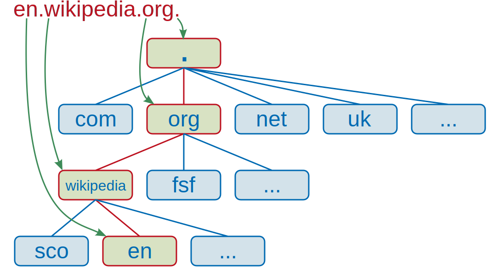

# **Domain name and DNS (Domain Name System)**
  
> **For simplicity, it gives your IP address simple and easy to remember names.** You can have more than one domain name per IP address (and vice versa). In fact, this is what makes *shared hosting* work, since shared hosting hosts multiple web sites with a single machine. (Of course, HTTP requires hostname as part of request so that the host can determine which web site to show. This is elaborated in section *Internet Protocols*.)  
  
A **distinct subset** of the internet with addresses sharing a common suffix or under the control of a particular organization or individual.
In other words, **a string that identifies** a realm of administrative autonomy, authority, or control (ex. SIP, Domain Keys in e-mail systems, and URI.) within the Internet is a domain name. It is used in various networking contexts and for application-specific naming and addressing purposes. It is often used to identify services provided through the Internet; that is, it **identifies a network domain, an IP resource, or a server computer**. Individuals will mostly use domain names to identify network domains. This abstraction allows any resources to be moved to a different physical location in the address topology of the network, both globally and locally.  
  
Then, what is network domain? **Network domain** is an administrative grouping of multiple private computer networks or local hosts within the same infrastructure. As mentioned earlier, domains can be identified using a domain name; domains which need to be accessible from the public Internet can be assigned a globally unique name within the Domain Name System (DNS).  It is common practice to use **Domain controller**.
  
**Domain controller** is a server computer that **responds to security authentication** within a computer network domain, that is, it authenticates users and stores user account information while enforcing security policy of the domain. It is a network server that is responsible for allowing host access to domain resources. They are typically deployed as a cluster to ensure high-availability and maximixze reliablilty.  
  
So how are domain names formed? They are formed by the rules and procedures of the ***Domain Name System (DNS)***. Structure of DNS is as follows.   
1. **Domain name space**  
    * Consists of a tree of domain names.
        - ***The domain name itself consists of the label, concatenated with the name of its parent node on the right, separated by a dot.***
         

    * Each node(or leaf) of the tree has a *label* and zero or more *resource record (RR)*, which holds information associated with the domain name. 
    * The tree sub-ivides into *zones* beginning at the DNS root zones. They are managed by a **name server**.  
         

        - DNS zone may consit as many domain and sub domains as the zone manager chooses.  
        - DNS can be partitioned according to the *class* (which is like an array of parallel namespace tree).  
        - Administrative responsibility for any zone may be divided by creating additional zones. Authority over the new zone is said to be *delegated* to a designated name server. The parent zone ceases to be authoritative for the new zone.
2. **Domain name syntax, internationalization** 
    * The definitive descriptions of the rules for forming domain names. (Look for RFC 1035, RFC 1123, RFC 2181, and RFC 5892)
    * The right-most label conveys the top-level domain (TLD). (ex. .com, .net, .org, .edu {These are also called 'generic TLD or gTLD'}])
    * The right-most label may also conveys the country code top-level domain(ccTLD). (ex. .kr)
    * IANA also ***reserves*** a set of special domain names. ***(ex. example, local, localhost, and test)***
    * The hierarchy of domains descends from right to left. Each label to the left specifies a subdivision, or subdomain of the domain to the right. (Second Level Domain = SLD)
        - These are usually administered by a *domain name registrar* who sell its its services to the public.
        - This means a tree with sub domains as root is delegated to them. 
    * This tree of subdivisions may have up to 127 levels, each with distinct label.
    * Each label may contain 0-63 octets(characters). 
        - The null label (of the zero length) is reserved for the root zone.
        - The full domain name may not exceed the length of 253 characters in its textual representation.
    * ***Hostname*** is a domain name that has at least one associated IP address. Usually TLDs are not hostnames, but if a ccTLD has an IP address, it can be a hostname.
    * ICANN approved the Internationalizing Domain Names in Applications (IDNA) system. Thus, we can map Unicode strings into valid DNS character set using Punycode.
3. **Name servers**
    * The Domain Name System is maintained by a *distributed database system*, which uses the client–server model. ***The nodes of this batabase are the name servers.***
    * Each domain has at least one authoritative DNS server that publishes information about that domain and the name servers of any domains subordinate to it. 
    * *Authoritative name server*
        - A name server that only gives answers to DNS queries from data that have been configured by an original source.
        - An authoritative name server can either be a primary server or a secondary server. 
            1. A primary server is a server that stores the original copies of all zone records.
            2. A secondary server uses a special automatic updating mechanism in the DNS protocol in communication with its primary to maintain an identical copy of the primary records.
        - Every DNS zone must be assigned a set of authoritative name servers. 
  
## *Domain name Registration*
* Administrative contact: A registrant usually designates an administrative contact to manage the domain name.
    - usually has the highest level of control over a domain.
    - installs additional contact information for technical and billing functions.
* Technical contact: The technical contact manages the name servers of a domain name.
    - assures conformance of the configurations of the domain name with the requirements of the domain registry
    - maintains the domain zone records
    - provides continuous functionality of the name servers (that leads to the accessibility of the domain name)
* Billing contact: The party responsible for receiving billing invoices from the domain name registrar and paying applicable fees.
* Name servers  
  
[**To index**](../ComputerNetwork.md)  
[**To previous page**](IPaddress.md)  
[**To next page**](URI.md)  