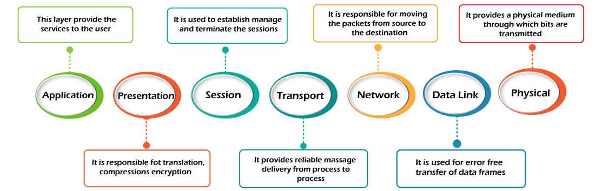

# **OSI (Open System Interconnection)**

> A reference model that describes how information from a software application in one computer moves through a physical medium to the software application in another computer. It was developed by the International Organization for Standardization (ISO) and is now considered as an standard architectural model for the inter-computer communication.  
  
It has consists of self-contained seven layers:  
1. Layer 7: Application
2. Layer 6: Presentation
3. Layer 5: Session
4. Layer 4: Transport
5. Layer 3: Network
6. Layer 2: Data Link
7. Layer 1: Physical

> Layer 4 in TCP/IP Model is equivalent to *Application Layer, Presentation Layer, and Session Layer of OSI model* **combined**. Layer 1 in TCP/IP Model is equivalent to *Data Link and Physical Layer of OSI model* **combined**.  
  
Layers can be coarsely divided into two layers:  
* Layer 4~7 is called ***upper layers*** and is *responsibility of the host*. Upper layers mainly deal with the application related issues and is implemented only in the software.  
* Layer 1~3 is called ***lower layers*** and is *responsibility of the network*. Lower layers mainly deal with the data transport related issues and are implented in both hardware and software. 
  
Below is summary diagram for OSI model.
 

  
  
---
## *Application Layer: Layer 7*
This layer is the closest layer to the end user and serves as a **window for end users and application processes to access network service**. (That is, it provides the network services to the end users.) Application layer and end user interact with each other through software application. Hence, ***application layer is not an application***. The application layer programs are based on client and servers.  

The application layer has the following three functions:
* **Identifying communcation partners**: This is related to network transparency. The application layer identifies the availability of communication partners for an application with data to transmit.
* **Determining resource availability**: This is related to resource reallocation. The application layer determines whether sufficient network resources are available for the requested communication.
* **Synchronizing communication**: All the communications occure between applications requires cooperation which is managed by an application layer.
  
Thus, the services of the application layer are:
* **Network virtual terminal**: *Allows a user to log on to a remote host*. To do so, the application creates a software emulation of a terminal at the remote host. The user's computer talks to this emulated terminal, which talks to the host. The remote host acts like it is communicating with one of its own terminals, thus allowing the user to log on.
* **File Transfer, Access, and Management (FTAM)**: *Allows a user to access files in a remote computer*, to retrieve files from a remote computer and to manage files in a remote computer. FTAM defines a hierarchical virtual files in terms of file structure, file attributes and the kind of operations performed on the files and their attributes.
* **Addressing**: To achieve communication between two machines, client and server, there is a need for addressing. A request from client contains the server address and its own address. Then, the server responds to it. [DNS](DomainName_DNS.md) is used.
* **Mail Service**: Provides e-mail forwaring and storage. (Think of this as FTAM and addressing combined.)
* **Directory Service**: An application contains a distributed database that provides access for global information about various objects and services. 
* **Authentication**: Authenticates the sender or receiver's message, or both.
  
There is two architectures of this layer.
* **Client-server architecture**: It is a architecture (or a model) in which computers such as servers provide the network services to the other computers such as clients to perform a user based tasks. An application program running on the local machine that sends a request to another application program is knwon as **client program**. Client program only runs when it requests for a service from the server. An application program that serves a request is known as a **server program**. Server program runs all the time since it does not know when the service will be required and provides services to all clients that requests services. Thus, in client-server model client-server relationship is many-to-one relationship.
    - Characteristrics of client-server:  
        + **Clients do not directly communicate with each other**. They use server as a medium.
        + **A server is fixed, well-known address known as IP address** because the server is always on while the client can always contact the server by sending a packet to the server's IP address.
    - Advantages of client-server:
        + **Centralized**: Centralized back-up is possible since all the data are stored in a server.
        + **Security**: This comes from centralization.
        + **Performance**: The use of dedicated server increases the speed of sharing resources, which in turn increases the performance of the overall system. 
        + **Scalability**: Increase of the number of clients and servers are independent. 
    - Disadvantage of client-server:  
        + It is **a single-server based architecture** which is incapable of holding all the requests from the clients. Thus resulting in ***traffic congestion***. 
        + Does not have robust network.
        + Has decisive network. Sometimes, regular computer hardware does not serve a certain number of clients. In such situations, specific hardware is required at the server side to complete the work.
        + Sometimes the resources might exist in the server but may not exist in the client. 
* **Peer-to-peer (P2P) architecture**: **It has no dedicated server** in a data center. The **peers** are the computers which are not owned by the service provider. The **peers communicate with each other without passing the information through a dedicated server**. (ex. File sharing and internet telephony, etc.) That, is any computer can be client or server. Thus, in P2P, we don'e label machines as client or server, we **label a process as client or server**. If a process request a service then that process is client process. If a process serves a request then that process is server process. Keep in mind that a process can be both client and server at the same time.
    - Characteristics of P2P:
        + **Self scalability**: In a file sharing system, although each peer generates a workload by requesting the files, each peer also adds a service capacity by distributing the files to the peers. That is, each new peer is service user but also a service generator.
        + **Cost-effective**: Since it does not require significant server infrastructure and server bandwidth, it is cost-effective.
> Application architecture is different from the network architecture. The network architecture is fixed and provides a set of services to applications. The application architecture, on the other hand, is designed by the application developer and defines how the application should be structured over the various end systems. The example of the network architecture is OSI model, and the examples of the application architecture are client-server and P2P. 
---  

[**To index**](../ComputerNetwork.md)  
[**To previous page**](TCP_IP.md)  
[**To next page**](NetworkModels.md)  