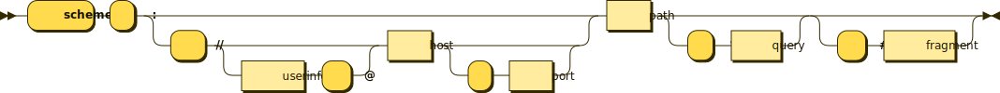

# **Uniform Resource Identifier (URI) (Superset of URL!!!)**
> ***A unique sequence of characters*** that ***identifies*** a logical or physical resource used by web technologies. URIs may be used to identify anything, including real-world objects, concepts, or information resources. Some URIs provide a means of **locating and retrieving information resources on a network** (either on the Internet or on another private network, such as a computer filesystem or an Intranet); these are ***Uniform Resource Locators*** (URLs). Other URIs provide only a unique name, without a means of locating or retrieving the resource or information about it, these are Uniform Resource Names (URNs).  
```
─── URI 
    ├── URL (locating and retrieving information)
    └── URN (Only provide unique name) 
```
URIs are used to identify anything described using the Resource Description Framework (RDF).  

***A Uniform Resource Name (URN)*** is a URI that identifies a resource by name in a particular namespace. A URN may be used to talk about a resource without implying its location or how to access it. (ex. ISBN {or International Standard Book Number})  
  
***A Uniform Resource Locator (URL)*** is explained in section *Uniform Resource Locator (URL) (A.K.A web address)*.  
  
## *Syntax*
> A URI has a scheme that refers to a specification for assigning identifiers within that scheme. As such, the URI syntax is **a federated and extensible naming system** wherein each scheme's specification may further restrict the syntax and semantics of identifiers using that scheme. The URI generic syntax is a superset of the syntax of all URI schemes.  
  
A URI is composed from an allowed set of ASCII characters consisting of **reserved characters** (*generic*: :, /, ?, #, [, ], and @; *scheme- or implementation-specific*: !, $, &, ', (, ), *, +, ,, ;, and =), **unreserved characters** (uppercase and lowercase letters, decimal digits, -, ., _, and ~), and **the character %**.  
  
Syntax components and subcomponents are separated by *delimiters* from the *reserved characters* (only from generic reserved characters for components) and define *identifying data* represented as unreserved characters, reserved characters that do not act as delimiters in the component and and subcomponent respectively, and percent-encodings when the corresponding character is outside the allowed set or is being used as a delimiter of, or within, the component. A percent-encoding of an identifying data octet is a sequence of three characters (consisting of the character % followed by the two hexadecimal digits representing that octet's numeric value) and is used for internationalization.  
  
The URI generic syntax consists of five components organized hierarchically in order of decreasing significance from left to right.  
```
URI = scheme ":" ["//" authority] path ["?" query] ["#" fragment]
```
A component is undefined if it has an associated delimiter and the delimiter does not appear in the URI; the scheme and path components are always defined. A component is empty if it has no characters; the scheme component is always non-empty.  
  
The authority component consists of subcomponents.
```
authority = [userinfo "@"] host [":" port]
```
<br><p align="center"></p>
  
The URI comprises:  
* A non-empty **scheme** component followed by a colon (:), consisting of a sequence of characters beginning with a letter and followed by any combination of letters, digits, plus (+), period (.), or hyphen (-). 
    - **Schemes** are case insensitive.
    - Canocical form is lowercase and documents that specify schemes must do so with lowercase letters. 
    - They should be registered with the IANA. (non-registered schemes are sometimes used.)
    - Examples: http, https, ftp, mailto, file, data, irc, and etc...
* An optional **authority** component preceded by two slashes (//), comprising:
    - An optional **userinfo** subcomponent followed by an at symbol (@), that may consist of a user name and an optional password preceded by a colon (:).
        + Use of the format username:password in the userinfo subcomponent is deprecated for security reasons. 
    - A **host** subcomponent, consisting of either a registered name (including but not limited to a hostname) or an IP address. 
        + IPv4 addresses must be in dot-decimal notation, and IPv6 addresses must be enclosed in brackets ([]).
    - An optional **port** subcomponent preceded by a colon (:), consisting of decimal digits.
* A **path** component, consisting of a sequence of path segments separated by a slash (/).
    - A path is always defined for a URI, though the defined path may be empty (zero length). 
    - A segment may also be empty, resulting in two consecutive slashes (//) in the path component. 
    - A path component may resemble or map exactly to a file system path but does not always imply a relation to one.
    - If an authority component is defined, then the path component must either be empty or begin with a slash (/). If an authority component is undefined, then the path cannot begin with an empty segment—that is, with two slashes (//).
    - By convention, in **http** and **https** URIs, the last part of a path is named **pathinfo** and it is optional. 
        + It is composed by zero or more path segments that do not refer to an existing physical resource name but to a logical part that has to be passed separately to the first part of the path (aka query part) that identifies an executable module or program managed by a web server.
* An optional **query** component preceded by a question mark (?), consisting of a query string of non-hierarchical data. Its syntax is not well defined, but by convention is most often a sequence of attribute–value pairs separated by a delimiter (& and :).
    - An http or https URI containing a pathinfo part without a query part may also be referred to as a 'clean URL' whose last part may be a 'slug'.
* An optional **fragment** component preceded by a hash (#). 
    - The fragment contains a fragment identifier providing direction to a secondary resource, such as a section heading in an article identified by the remainder of the URI. 
    - When the primary resource is an HTML document, the fragment is often an id attribute of a specific element, and web browsers will scroll this element into view.
  
The scheme- or implementation-specific reserved character + may be used in the scheme, userinfo, host, path, query, and fragment, and the scheme- or implementation-specific reserved characters '!', '$', '&', ''', '(', ')', '*', ',', ';', and '=' may be used in the userinfo, host, path, query, and fragment. Additionally, the generic reserved character ':' may be used in the userinfo, path, query and fragment, the generic reserved characters '@' and '/' may be used in the path, query and fragment, and the generic reserved character '?' may be used in the query and fragment.
  
## *Examples*
```URI
          userinfo       host      port
          ┌──┴───┐ ┌──────┴──────┐ ┌┴┐
  https://john.doe@www.example.com:123/forum/questions/?tag=networking&order=newest#top
  └─┬─┘   └───────────┬──────────────┘└───────┬───────┘ └───────────┬─────────────┘ └┬┘
  scheme          authority                  path                 query           fragment

  ldap://[2001:db8::7]/c=GB?objectClass?one
  └┬─┘   └─────┬─────┘└─┬─┘ └──────┬──────┘
  scheme   authority   path      query

  mailto:John.Doe@example.com
  └─┬──┘ └────┬─────────────┘
  scheme     path

  news:comp.infosystems.www.servers.unix
  └┬─┘ └─────────────┬─────────────────┘
  scheme            path

  tel:+1-816-555-1212
  └┬┘ └──────┬──────┘
  scheme    path

  telnet://192.0.2.16:80/
  └─┬──┘   └─────┬─────┘│
  scheme     authority  path

  urn:oasis:names:specification:docbook:dtd:xml:4.1.2
  └┬┘ └──────────────────────┬──────────────────────┘
  scheme                    path
```

[**To index**](../ComputerNetwork.md)  
[**To previous page**](DomainName_DNS.md)  
[**To next page**](URL.md)  